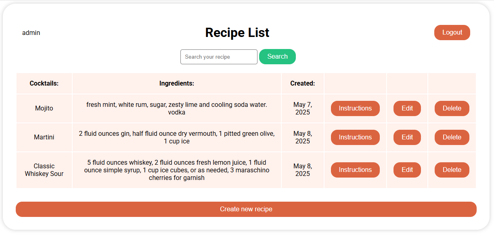

# 🍸Recipe List 


Strona internetowa do zapisywania przepisów na koktajle w Django z rejestracją użytkowników.

## 📑 Spis treści

- [Opis projektu](#opis-projektu)
- [Struktura pojektu (MVC)](#-struktura-projektu-mvc)
- [Funkcjonalności](#funkcjonalności)
- [Technologie](#technologie)
- [Instalacja](#instalacja)
- [Uruchomienie](#uruchomienie)

---

## 📝 Opis projektu

- Projekt umożliwia zarządzanie tabelą z listą przepisów: dodawanie, edycję, przeglądanie i usuwanie.
- Każdy przepis zawiera nazwę, składniki, datę utworzenia i instrukcję przygotowania.
- Interfejs użytkownika umożliwia również przeglądanie tabeli i przeszukiwanie bazy danych według nazwy.  
- Projekt ma rejestrację użytkowników, co oznacza, że każdy użytkownik będzie widział tylko swoją tabelę i nie będzie mógł wchodzić w interakcje ani widzieć innych tabel

---

## 📂 Struktura projektu (MVC)

- **Model:** `models.py` – logika biznesowa i dane.
- **Widok:** `templates/` – interfejs użytkownika.
- **Kontroler:** `views.py` – logika sterująca i przepływ danych.

---

## ✅ Funkcjonalności

- Dodawanie nowych przepisów
- Przeglądanie listy przepisów na stronie internetowej
- Szczegóły przepisu (przycisk instructions)
- Edycja i usuwanie przepisów (przycisk Edit i Delete)
- Wyszukiwanie według nazwy
- Logowanie użytkowników

---

## 💻 Technologie

- Python 3.10
- Django 5.2.1
- SQLite (wbudowana baza danych w Django)

---

## ⚙️ Instalacja

1. Sklonuj repozytorium:

```bash
git clone https://github.com/twoj-login/RecipeList.git
cd RecipeList
```

2. Utwórz i aktywuj środowisko wirtualne:

```bash
python -m venv venv
```

3. Zainstaluj zależności:

```bash
pip install -r requirements.txt
```

4. Wykonaj migracje i uruchom serwer:

```bash
python manage.py migrate
python manage.py runserver
```

Aplikacja będzie dostępna pod adresem: [http://localhost:8000](http://localhost:8000)  


